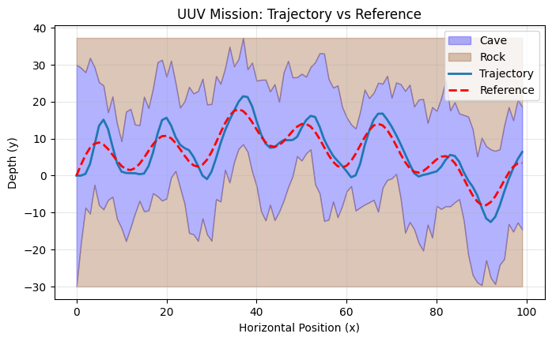

# Rahul Marchand B1 Report

**GitHub Repository:** [https://github.com/rahul-marchand/b1-coding-practical-mt24](https://github.com/rahul-marchand/b1-coding-practical-mt24)

**Note:** Claude Code was used to help with the project

## Problems Solved

1. **Mission Data Persistence**: Implemented CSV import/export for reproducible mission testing and sharing.
2. **Closed-Loop Control**: Developed PD controller and simulation framework for autonomous depth trajectory tracking with disturbance rejection.

## Changelog

**New Files:** `uuv_mission/control/` - PD controller module with `PDController` class (default gains: kp=0.15, kd=0.6), previous error state management, and `reset()` method.

**Modified Files:** `uuv_mission/dynamic.py` - Added `Mission.from_csv()`, integrated controller with plant dynamics, improved plotting. `notebooks/demo.ipynb` - Added test cases for random missions, CSV loading, and gain tuning.

## Design Choices

**PD Controller**: Chosen for simplicity (two parameters), sufficient performance for depth tracking, and avoidance of integral windup issues. **Class-Based Architecture**: Enables state management (previous error storage), extensibility (common interface for future controllers), and configurability (adjustable gains at instantiation). **Discrete-Time Implementation**: Uses finite difference for derivative term (`e[t] - e[t-1]`), matching the discrete timestep (`dt=1`).

## Future Work

Advanced controllers (PID, LQR, MPC), automatic gain tuning, 3D navigation, adaptive control, disturbance estimation, and safety features (collision avoidance, emergency procedures).

\newpage

# Appendix: Results

## Test 2: Mission from CSV

The plot demonstrates successful trajectory tracking under random disturbances (variance=0.5). The submarine closely follows the reference trajectory while staying within cave boundaries.
